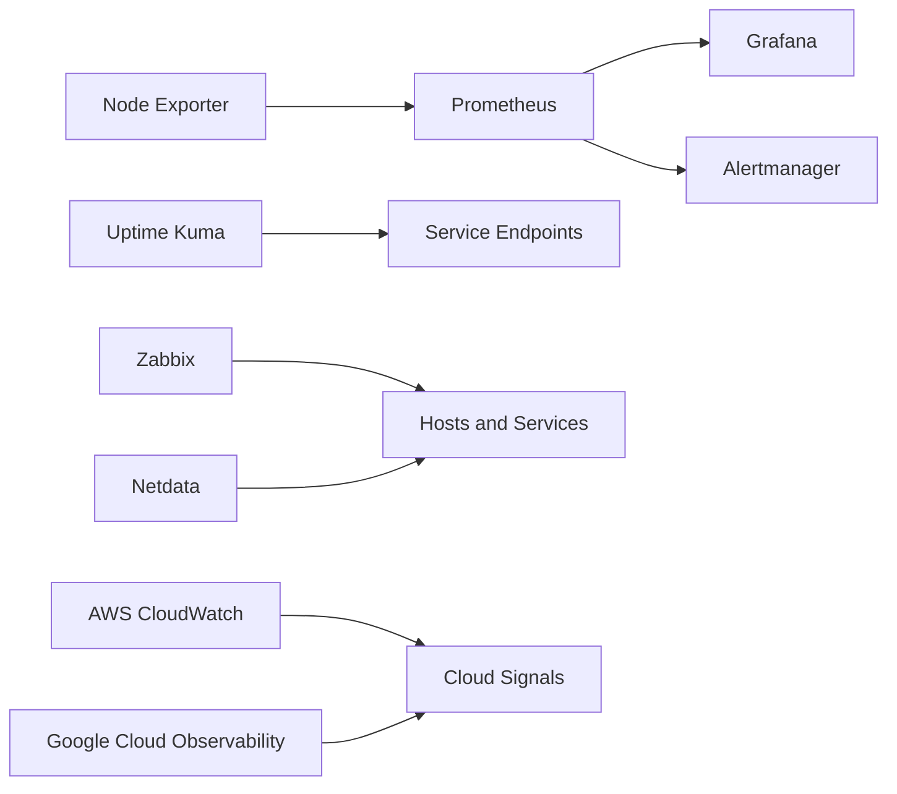

# Architecture

The local stack demonstrates metrics collection, visualization, alert evaluation, and endpoint availability. Zabbix and Netdata are isolated guided deployments so their behavior can be validated without making the default Compose stack unnecessarily heavy. AWS and GCP sections document cloud-native equivalents and safe CLI workflows.

## Signal ownership

| Signal | Primary tool | Validation |
|---|---|---|
| Linux host metrics | Node Exporter + Prometheus | Target is `UP`; metric query returns data |
| Dashboards | Grafana | Provisioned Prometheus data source is healthy |
| Alert evaluation | Prometheus + Alertmanager | Rules load and Alertmanager is reachable |
| HTTP/TCP availability | Uptime Kuma | Monitor heartbeat and controlled failure test |
| Infrastructure inventory | Zabbix | Host, item, trigger, and latest-data validation |
| Real-time host health | Netdata | Charts show CPU, memory, disk, and network data |
| AWS telemetry | CloudWatch | Metric/alarm/log query in sandbox account |
| GCP telemetry | Cloud Monitoring/Logging | Metric/log query in sandbox project |
